# WC1 Reflight

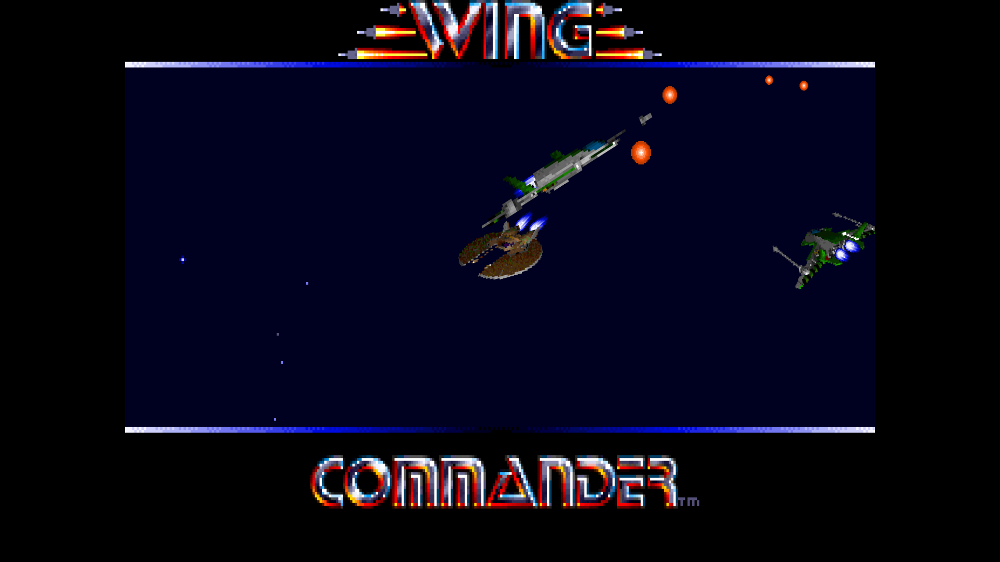

*Wing Commander* (Origin Systems, 1990) for today's computers: a native, cross-platform
reimplementation in C# / .NET 10 that plays the original DOS game data, with a modern Vulkan
renderer, sharp ships and text at any screen resolution, and the original music and gameplay.

> **No game data is included.** You need your own copy of Wing Commander, for example the GOG
> release "Wing Commander 1+2". *Wing Commander* is a trademark of Electronic Arts; this is an
> unofficial fan project.

## What is new compared to the original game

| Area | Original (DOS, 1990) | WC1 Reflight |
| --- | --- | --- |
| Platform | DOS (today: DOSBox or the Kilrathi Saga build) | Native Windows, Linux and macOS; one NativeAOT executable, no emulator |
| Rendering | 320x200, 256 colours | Vulkan renderer (MoltenVK on macOS) with SDL fallback; resizable window, fullscreen, 4:3 aspect correction or square pixels, nearest / sharp-bilinear / linear filtering, integer scaling, vsync |
| Ships in space | Pixel sprites scaled inside 320x200 | Ships, missiles, explosions and asteroids are drawn at your screen resolution (smooth scaling and rotation, far sharper ship models); the cockpit and HUD stay pixel-exact on top |
| Text | Four pixel fonts | All text drawn at screen resolution: crisp vectorized originals or modern replacement fonts (see [Fonts](#fonts)); text drawn into off-screen buffers (space view, scenes, saved backgrounds) is followed too |
| Help | Printed manual | **F10** shows the flight controls next to the cockpit (in the side margins of widescreen displays, otherwise as a panel) |
| Menus | None | **Esc** opens a pause menu (in flight, in the rooms and on the title) with **settings**: volumes, fullscreen, filter, aspect ratio, vsync, sharp text, fonts, key help and **flight keys** (every flight control can be put on another key); saved in `config.json` |
| Briefing | The wall screen shows the same shrunken, unreadable map in every briefing | The wall screen shows this mission's nav map, its text sharp and readable |
| Mouse | The cursor moves with the game's 16 frames per second | The cursor follows the mouse at the display's refresh rate |
| Sound | AdLib / Sound Blaster | The original Origin FX music and sound effects on an emulated OPL2 (port of ymfm) |
| Saves | Next to the game | In your user data folder; existing DOS saves are imported automatically |
| Controls | DOS keyboard repeat | Key repeat identical on every system, Alt+X quits anywhere |
| Fixes | | Planets drawn as sprites, cockpit display static and cockpit explosion animation restored (`--ks-literal` returns to the Kilrathi Saga look) |

Gameplay, simulation, AI and timing follow the reverse-engineered Kilrathi Saga build
([neuromancer/wc1-re](https://github.com/neuromancer/wc1-re)), running on a deterministic
virtual clock: the same input gives the same mission, which also makes the whole game testable.

### Side by side

The same moment, rendered at 1440x1080 by the original 320x200 path and by WC1 Reflight.
Ships, shots and explosions keep their detail instead of being shrunk into 320x200 first:

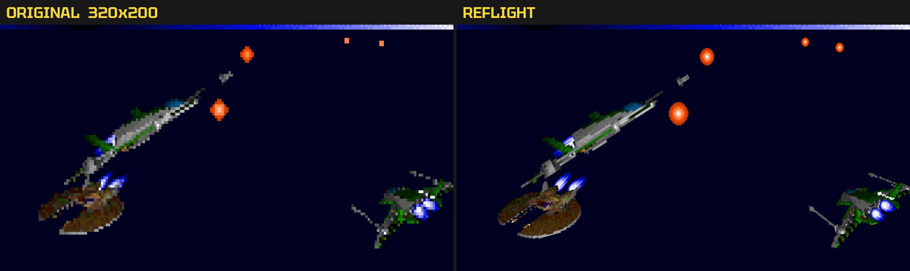

Text is drawn at screen resolution, here in the replacement font of conversations and briefings:

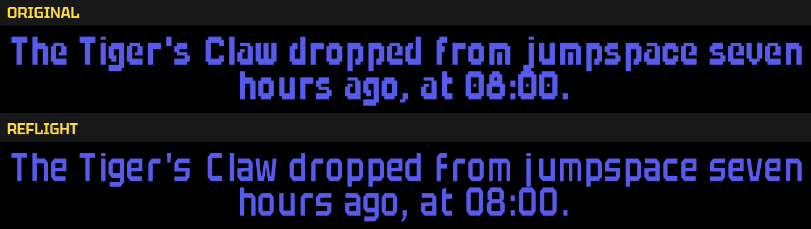

The briefing's wall screen shows the mission's own map, its text readable:

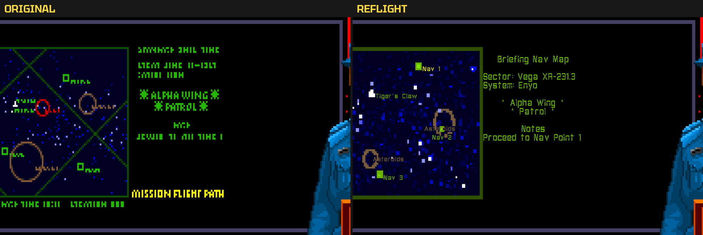

### In the game

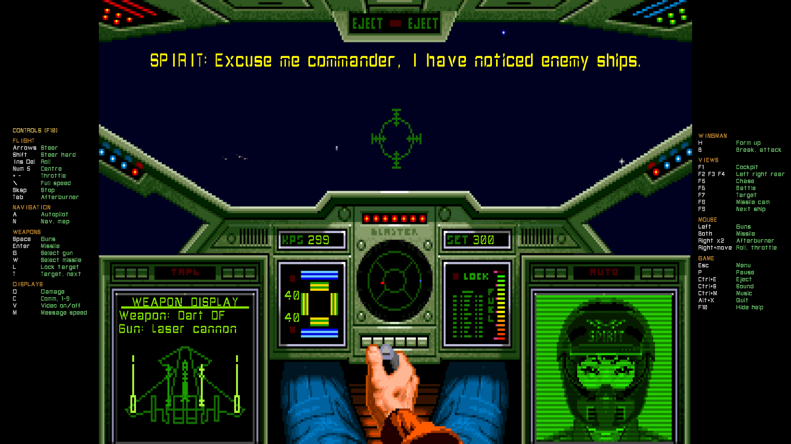

*Cockpit at 1920x1080: radio messages and cockpit displays at screen resolution, the key help
(F10) in the side margins.*

<table>
  <tr>
    <td width="50%">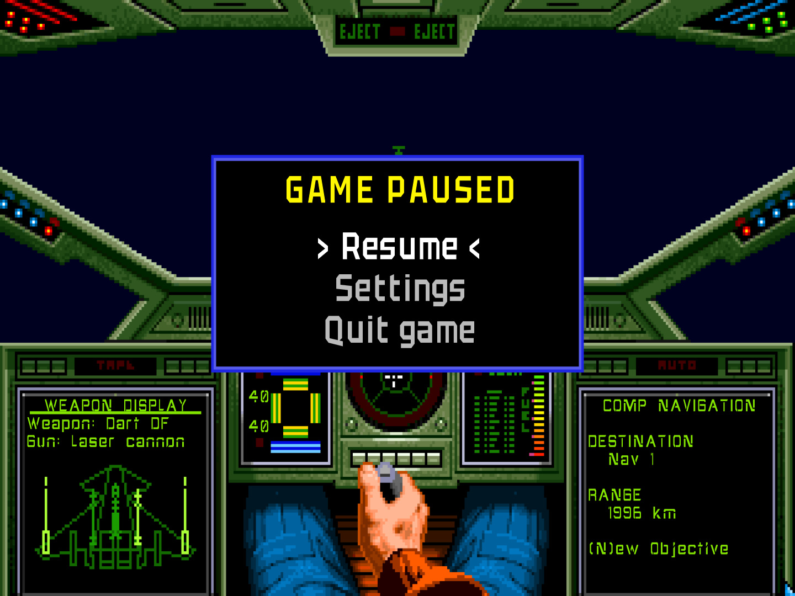</td>
    <td width="50%">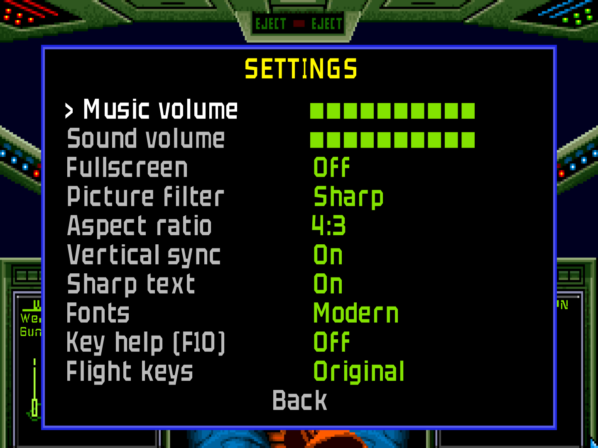</td>
  </tr>
  <tr>
    <td><em>Esc opens the pause menu in flight, in the rooms and on the title.</em></td>
    <td><em>Settings apply at once and are saved in <code>config.json</code>.</em></td>
  </tr>
  <tr>
    <td width="50%">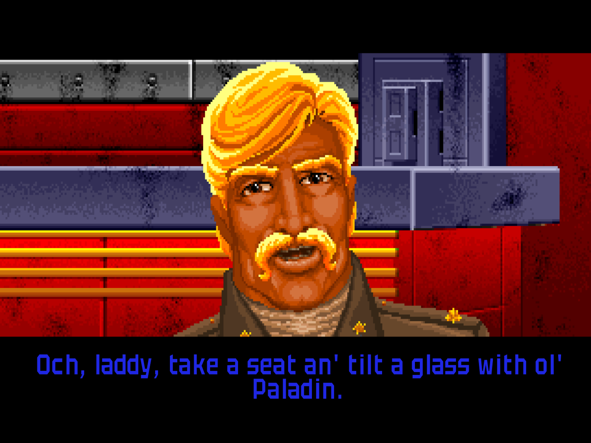</td>
    <td width="50%">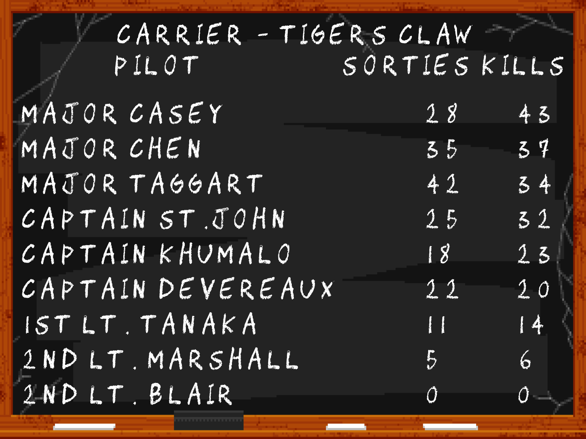</td>
  </tr>
  <tr>
    <td><em>Conversations and briefings in Tektur.</em></td>
    <td><em>The kill board in the CHAWP chalk font.</em></td>
  </tr>
  <tr>
    <td width="50%">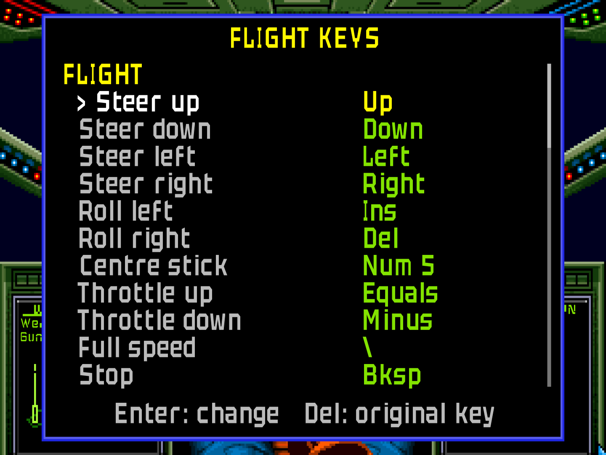</td>
    <td width="50%">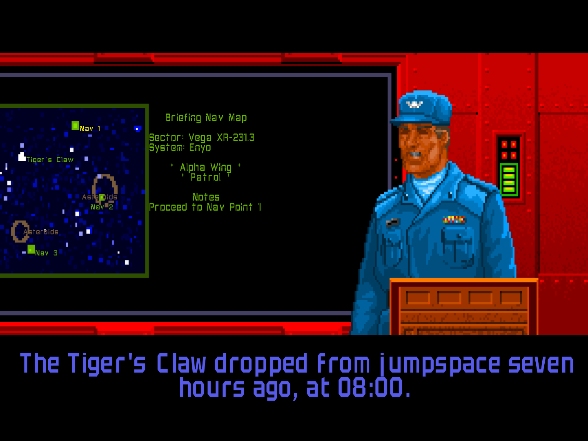</td>
  </tr>
  <tr>
    <td><em>Flight keys: every control on the key you want.</em></td>
    <td><em>The briefing board with the mission's map.</em></td>
  </tr>
</table>

The screenshots are rendered by [`scripts/readme-screenshots.py`](scripts/readme-screenshots.py)
from a scripted, headless run of the game (`wc1tool snap --gpu`). They show game art, which is
copyright Electronic Arts.

## Getting started

1. Install the [.NET 10 SDK](https://dotnet.microsoft.com/download).
2. Copy `config.example.json` to `config.json` and set `gameDirectory` to your Wing Commander
   folder (the install folder or its `GAMEDAT` folder). `config.json` stays on your machine.
3. Run the game:

```bash
dotnet run --project src/WingCommander -c Release
```

The game directory can also be given with `--game <dir>` or the `WC1_GAME_DIR` environment
variable. Useful options:

| Option | Effect |
| --- | --- |
| `--fullscreen`, `--window`, `--scale N` | Fullscreen or window (overrides the setting); window size N times 320x240 |
| `--filter nearest\|sharp\|linear`, `--square-pixels`, `--integer`, `--no-vsync` | Picture options |
| `--renderer auto\|vulkan\|sdl` | Renderer (default: Vulkan with SDL fallback) |
| `--classic-space` | Draw space objects into the 320x200 picture like the original |
| `--classic-text`, `--original-fonts` | Original pixel text, or vectorized original fonts instead of the replacement fonts |
| `--ks-literal` | Kilrathi Saga look (no visual fixes) |
| `--skip-intro`, `--no-audio` | Start faster, play silently |
| `-- <switches>` | The original game's command-line switches |

In flight, all original controls apply; **Esc** opens the pause menu with the settings, **F10**
toggles the key help, **Alt+X** quits. Settings > Flight keys puts any flight control on another
key (the key help shows your keys). The settings are saved in `config.json`; command-line
options override them for one run.

### Native executable

On Windows, `build.bat` builds a native, self-contained and trimmed executable (NativeAOT) into
`publish\win-x64` (`build.bat win-arm64` for ARM): just `wc1.exe` (about 4 MB, fonts compiled
in), `SDL3.dll` and `THIRD-PARTY-NOTICES.txt`. It needs Visual Studio or the Build Tools with the
"Desktop development with C++" workload. On Linux and macOS:

```bash
dotnet publish src/WingCommander -c Release -r linux-x64 -p:DebugType=none -o publish/linux-x64   # or osx-arm64
```

Put `config.json` next to the executable (or in a parent folder). See [docs/BUILD.md](docs/BUILD.md).

## Fonts

With the Vulkan renderer the game's text is drawn at output resolution: the four game fonts are
replaced by these fonts (sources and licences in [`assets/fonts/`](assets/fonts/), compiled into
the game):

| Game font | Used for | Replacement |
| --- | --- | --- |
| 0 | conversations, briefings, prompts, room labels | **Tektur** SemiBold by Adam Jagosz, copyright 2023 The Tektur Project Authors ([github.com/hyvyys/Tektur](https://github.com/hyvyys/Tektur), [Google Fonts](https://fonts.google.com/specimen/Tektur)), licensed under the [SIL Open Font License 1.1](https://openfontlicense.org) |
| 1 and 2 | HUD messages, cockpit displays, speed readouts, nav map, training simulator | **SPACE WING LEADER** by SFO, made with [FontStruct](https://fontstruct.com/fontstructions/show/2704307), licensed under [CC BY 3.0](https://creativecommons.org/licenses/by/3.0/) |
| 3 | chalk board (kill board) in the rec room | **CHAWP**, copyright (c) 2013 Ancient Wisdom Productions ([awpny.com](http://www.awpny.com)), Reserved Font Name CHAWP, licensed under the [SIL Open Font License 1.1](https://openfontlicense.org) |

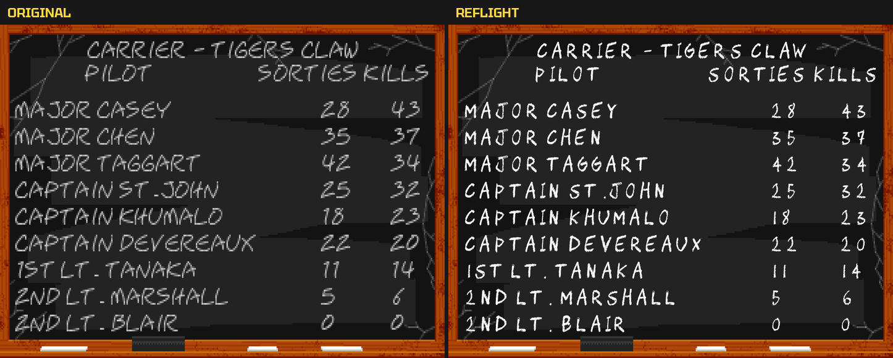

The replacement glyphs are fitted into the original glyph cells, so the game's text layout is
unchanged; characters a font does not have and the gauge symbols of font 2 keep the original
design, vectorized. The classic 320x200 picture (SDL renderer, `--classic-text`) always shows
the original fonts; `--original-fonts` keeps the vectorized originals at output resolution.

## Project layout

```
src/WingCommander.Core            data formats, fixed-point math, virtual clock, rendering contracts
src/WingCommander.Graphics        320x200 raster library: shapes, fonts, palettes, text tracking
src/WingCommander.Audio           OPL2 emulation, Origin FX music and sound effects
src/WingCommander.Simulation      space flight: objects, weapons, collisions, AI, missions
src/WingCommander.Game            game flow, campaign, rooms, briefings, cutscenes
src/WingCommander.Game.Flight     cockpit, HUD, flight controls and sequences
src/WingCommander.Render.Vulkan   Vulkan renderer (classic layer, sprites, text, overlay)
src/WingCommander.Host.Sdl        SDL3 window, input, audio, fallback renderer
src/WingCommander                 the game executable (wc1)
src/WingCommander.Tools           wc1tool: data inspection, exports, headless screenshots
tests/                            xunit tests per project (game-data tests run when config.json is set)
docs/                             architecture, decisions, analysis of the original, progress
docs/images/                      README screenshots (scripts/readme-screenshots.py)
```

Start with [docs/README.md](docs/README.md) for the architecture, the analysis of the original
code and the porting notes.

## Roadmap

- Backgrounds widened to 16:9 and 16:10 for the rooms and scenes
- Joystick and gamepad support
- 3D ship models (glTF, PBR) and ray-traced effects on capable GPUs

## License

WC1 Reflight is free software under the [GNU General Public License v3.0](LICENSE). It is a
translation of the reconstructed source of [neuromancer/wc1-re](https://github.com/neuromancer/wc1-re),
which is GPL-3.0 as well. Bundled third-party components keep their own licences, all
GPL-compatible and reproduced in [`THIRD-PARTY-NOTICES.txt`](THIRD-PARTY-NOTICES.txt): ymfm
(BSD-3-Clause), Tektur and CHAWP (SIL Open Font License 1.1), SPACE WING LEADER (CC BY 3.0);
SDL3 (zlib) and Vortice.Vulkan (MIT) come as NuGet packages.

*Wing Commander* and its game data are copyright Electronic Arts. They are not part of this
project and not covered by its licence.

## Credits

- [neuromancer/wc1-re](https://github.com/neuromancer/wc1-re): the reverse-engineered C source
  of the Kilrathi Saga build that this reimplementation follows.
- [ymfm](https://github.com/aaronsgiles/ymfm) by Aaron Giles (BSD-3-Clause): the OPL2 emulator
  ported to C#.
- All third-party licences ship with the executable in `THIRD-PARTY-NOTICES.txt`.
- [SDL3](https://www.libsdl.org/) via [ppy.SDL3-CS](https://github.com/ppy/SDL3-CS) and
  [Vortice.Vulkan](https://github.com/amerkoleci/Vortice.Vulkan).
- The fonts listed above.
